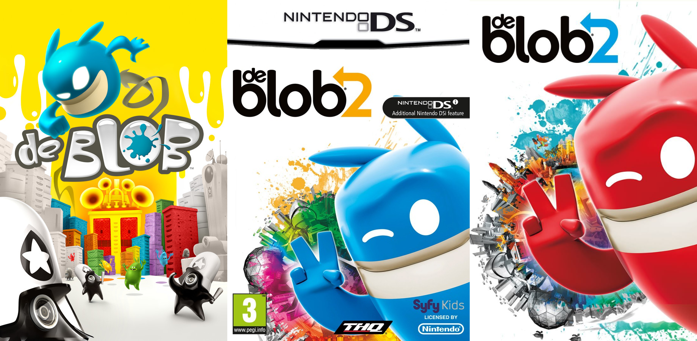

# deBlob_manual_apworlds
Manual apworlds for the de Blob Series, made with [Manual for Archipelago](https://github.com/ManualForArchipelago/Manual).

# [<u>**>>Click here to download latest release<<**</u>](https://github.com/Iristallite/deBlob_manual_apworlds/releases/latest)
## How do I use this?
I will refer you to the offical [Archipelago setup guide](https://archipelago.gg/tutorial/Archipelago/setup_en) for how to set up Archipelago.

Use the `Install APWorld` option in the Archipelago launcher to install the `.apworld` files from the [Releases tab](https://github.com/Iristallite/deBlob_manual_apworlds/releases/latest)  
I have also provided some template `.yaml` files with the release.  
You can also just grab the `.apworld` and `.yaml` files from the folders, but I'd recommend sticking to the Releases for simplicity's sake.

## What's a *de Blob?*

  </img> 
  <b>de Blob</b>, <b>de Blob 2 (DS)</b>, and <b>de Blob 2</b> copyright 2008-2011, 2018 THQ Nordic GmbH 

de Blob and de Blob 2 are 3D platformers all about color![sic][^1]  
I'm sorry if you're colorblind.

de Blob 1 is more open-ended; you can complete level challenges in any order, and the only thing blocking the exit is your score.  
de Blob 2 is more story-driven; you have to complete each level's missions in order....unless you use speedrun skips  
de Blob 2 (DS) is a linear 2D platformer that still retains some gameplay elements from the console games.
## Where can I get the games?
* de Blob 1: [Steam](https://store.steampowered.com/app/532320/de_Blob), [GOG](https://gog.com/game/de_blob), [Switch](https://nintendo.com/store/products/de-blob-switch), [Xbox One](https://xbox.com/games/store/de-blob/c092flk91x41), [PS4](https://store.playstation.com/product/UP4389-CUSA09934_00-DEBLOBONEUS00001), Wii[^2]
* de Blob 2 (DS/DSi): Unfortunately you'll need to find a second-hand cartridge for this one.
* de Blob 2: [Steam](https://store.steampowered.com/app/563190/de_Blob_2), [GOG](https://gog.com/game/de_blob_2), [Switch](https://nintendo.com/store/products/de-blob-2-switch), [Xbox 360](https://xbox.com/games/store/de-blob-2/btzcngwlqpz0)[^3], [Xbox One](https://xbox.com/games/store/de-blob-2/c360xv52r4nl), [PS4](https://store.playstation.com/product/UP4389-CUSA10447_00-DEBLOB2US0000001), PS3[^4]
* There is also a [Steam bundle](https://store.steampowered.com/bundle/44665/de_Blob_Bundle/) of de Blob 1 and de Blob 2.

## Which versions should I play?

For dB1, honestly they're all pretty fine, but the Switch version is the worst feature-wise and the Wii version is the worst muscle-wise.  
For dB2, the Steam version is fine enough, but has lower quality SFX compared to PS3, and a looping audio bug that I always include a patch for in releases.  

de Blob 1 - Wii  
\+ Original release, most accurate  
\+ Still cheap on the used market (~$10 CAD as of early 2026)  
\+ Does not strictly require the use of the pointer  
\+ Has a RetroAchievements set if you're into that  
\~ Button mashing events are instead Wiimote/Nunchuk flails, but this is actually less physically demanding  
\~ HUD is *much* bigger compared to the HD releases  
\- Limited to 480p  
\- Jumping is mapped to a Wiimote waggle (You can find gecko codes to fix this and add Classic Controller support)  
\- Broken visuals on Dolphin even as of 2603a  

de Blob 1 - PS4/Xbox One/PC  
\+ Maintains consistent 1080p 60fps on base PS4, and likely also Xbox One/One S  
\+ Jumping is a button press instead of a waggle  
\+ Often on digital sale for cheaper than used Wii version  
\~ Cutscene upscaling is a simple bilinear pass, nothing fancy but mostly preserves all original detail  
\- Cutscenes have slightly delayed audio  
\- Cutscenes use the outdated Theora codec instead of a newer free codec like VP8 or VP9  
\- Wiimote/Nunchuk flail events are now a button masher, which is actually more physically demanding  

de Blob 1 - Nintendo Switch  
\+ Portable  
\- All prior issues with PS4/Xbox One/PC still apply  
\- Drops to a *very* unsteady 30fps (or worse) in handheld mode due to attempting to render at 1080p  
\- Missing a lot of sound effects compared to other versions  
\- "Unstoppable" BGM is bugged and loops a crowd cheering sound effect  
\- Smoke particles on Zip's flares don't appear  
\- 5-2 (Jetbike Blitz) is bugged and all jetbikes instantly crash upon spawning, making the level a joke in terms of difficulty  

de Blob 1 - Nintendo Switch (Switch 2 BC)  
\+ Maintains consistent 1080p 60fps even when Handheld Boost is turned off  
\+ Smoke particles on Zip's flares re-appear? That was hardware-related??  
\+ 5-2 (Jetbike Blitz) is slightly less bugged; now only the final jetbike spawner crashes instantly  
\- Most prior issues with Switch version retained  

de Blob 2 - Wii  
\+ Still runs at a consistent 60fps! Very nice! ~~FUCK THE SWITCH VERSION~~  
\+ Doesn't require the pointer  
\+ Jumping is now a button press, thank god  
\+ Supports both 4:3 and 16:9 aspect ratios  
\- Reduced SFX quality and variety due to limited RAM on Wii (~88MB compared to ~256MB on PS3/360)  
\- Limited to 480p  
\- Compiled before the PS3/360 versions, has a few exclusive minor bugs  
\- Visuals on Dolphin even more broken than dB1, even on 2603a

de Blob 2 - Xbox 360  
\+ Still available for purchase after 360 Marketplace closure due to being a BC title on Xbox One/Series
\+ Runs at 60fps  
\+ Higher quality and more varied sound effects than Wii  
\+ 5.1 digital surround sound  
\+ Stereoscopic 3D gameplay  
\+ Supports both 4:3 and 16:9 aspect ratios  
\~ Renders slightly below HD (1152x648)  
\~ Some events are still button mashers but it takes FAR less mashing than the HD releases of dB1  
\~ Second release compiled, less buggy than Wii version  
\- Broken on Xenia, crashes soon after starting a level and deadlocks controller rumble  
\- 3D gameplay halves framerate and horizontal resolution per-eye  
\- Skip button is on BACK, which is inconvenient  

de Blob 2 - PS3 (PlayStation 3)  
\+ In my opinion, the definitive version  
\+ Renders at a full 1280x720  
\+ Subjectively better anti-aliasing compared to Xbox 360  
\+ Still supports 4:3 480p if you want to play on a CRT  
\+ Skip button is on Triangle, a much more convenient mapping than on Xbox 360  
\+ Highest quality sound effects  
\+ Highest quality cutscenes  
\+ 5.1 digital surround sound in gameplay AND cutscenes  
\+ PlayStation Move support for Wii-like controls  
\+ Allows for shaking the DualShock 3/Move Motion Controller OR mashing Jump for QTEs  
\+ Stereoscopic 3D gameplay AND cutscenes  
\+ Better 3D support than Xbox 360 version  
\+ Last of the original three releases compiled: least buggy as a result  
\+ Runs perfectly on RPCS3... if your PC can handle it, it's a decently demanding game  

de Blob 2 - PC (Steam)... It could have been worse!  
\+ Most convenient version  
\+ Often on digital sale for pretty cheap  
\+ Pinky Co-op mapped to the mouse cursor, very smart  
\+ SFX panning issue was quickly patched after launch  
\+ Cutscenes were ULTRA borked at launch but were patched along with SFX panning  
\- Cutscenes are still slightly borked - delayed audio and poor mixing of rear channels  
\- Cutscenes still use the outdated Theora codec instead of a newer free codec like VP8 or VP9  
\- Cutscenes "upscaled" to 1080p with a bilinear filter - no new detail, waste of bitrate and storage space (This version is nearly 50% larger than the PS3 version)  
\- ONLY supports 16:9 aspect ratio - attempting to play with anything else results in stretched/squashed visuals  
\- HUD is slightly misaligned vertically  
\- Pinky's warning sprite on the HUD has apparently been chopped up and rearranged incorrectly (harmless and mildly funny bug)  
\- Audio loop issue remains unpatched, requiring an additional patch (which I always include with releases of these apworlds)  
\- Sound effects during final level and final boss fight are slightly bugged, repeating in slow motion and lessening the impact of the whole thing  
\- Final Boss's introduction splash clips out of bounds* and fills the screen with gray (surprisingly in-character)  
\- No native PlayStation controller support or prompts  
\~ Uses Xbox 360 button prompts rather than Xbox One prompts?  
\~ It could have been worse... and it will very quickly get worse as I move onto the PS4 and Switch ports...  

de Blob 2 - PS4... what the hell happened here  
\+ Skip button moved from Triangle to Square, making it even easier to skip dialog and cutscenes  
\- On base PS4, unstable framerate around 40-50fps, feels HORRENDOUS as animation timing is fucked if the FPS isn't an exact multiple or divisor of 60  
\- Most prior issues from PC version also apply  
\- I have not tested on PS4 Pro but it's *probably* much better when Boost Mode is on  
\- I have not tested on PS5 BC either, but it's safe to assume the performance issues are solved entirely  

de Blob 2 - Nintendo Switch... what the FUCK happened *here???* It keeps getting worse!!!  
\- CAPPED at 30fps???  
\+ At least more consistent animation timing and thus marginally better game feel than PS4, but still falls behind even the damn Wii version  
\+ Skip button is on Y, the same physical location as the PS4 version (which has it on Square)  
\- Most prior issues from PC version also apply  
\- Cutscenes somehow even more borked than PS4, now they stutter!  
\- Struggles to maintain 30fps sometimes??????  
\- Graphical corruption when talking to certain NPCs  
\- In handheld mode, Pinky's targeting cursor is broken and doesn't lock onto anything  
\- Almost zero improvement from Switch 2 BC apart from the res boost offered by Handheld Boost Mode  

de Blob 2 - PC (GOG)  
??????  
Hopefully identical to the Steam version.

de Blob 2 - Xbox One  
??????  
If base PS4 is anything to go by, AVOID unless you have a more powerful Xbox One X or Series X|S console.

## How do these manual apworlds work, exactly?
...They don't! At least in terms of connecting to the game.well, duh, they're *manual* apworlds  
More seriously, you'll have to rely on 100% save files ([dB1](https://speedrun.com/de_Blob/resources/m5gk0), [dB2](https://speedrun.com/dB2/resources/ezw7w), [dB2 DS](https://speedrun.com/db2ds/resources/iix74)) and/or [ingame cheats](#ingame-cheats) to affect the game directly.  
This apworld shuffles each level as an item, as well as a specific amount of "McGuffins" that you'll need to open the final level(s).  
In addition, there are some traps, cheats, upgrades (dB2), and some extra-special *diabolical traps* that are sure to ruin your day... if you're playing in a sync multiworld....receiving a "Restart Level" when you're playing a different game... entirely defeats the point, eh?  
Also there's DeathLink if you're into that.
## Wait, how does DeathLink work in a manual?
1. Locate the nearest source of damage or bottomless pit
2. Touch it until Blob dies and loses a life
3. Acknowledge you have received the deathlink by pressing the button in the client
4. If you continue from a game over in dB2, you should probably say goodbye to your S rank  
If you die accidentally, *you* send a deathlink to everyone else
## de Blob 1: Checks
Most of these can be toggled with yaml options.
* `Level Complete (Bronze Medal)`: Complete the level with at least a Bronze Medal.
* `Silver Medal`, `Gold Medal`: Self-explanatory.
* `25%/50%/75%/100% Painted`: Paint *everything* in the level. If you can't find the last thing, try holding the Compass button!
* `Challenger`: Complete all *Challenges* within the level. This usually also gets you the `Architect` check (Landmarks Award) as well.
* `Speedrunner`: Beat the target *Time* listed under `(Main Menu) --> EXTRAS --> AWARDS --> (LEVEL)`. Stringing together combos is the key!
* `Stylist`: What a *style!* Collect them all!
* `Naturalist`: Save the *trees!* Restore them all!
* `Architect`: Shake! Shake! Shake! Restore all the *landmarks* INKT has defaced!
* `Billboard Artist`: You hate advertising, don't you? Tag all the *billboards!*
* `Transformer`: Optimus Paint Engine.  
Activate all the *Transform* Engines in each level; they spawn at certain Score intervals, and will always interrupt you with a skippable cutscene when they do.  
Yes, "Optimus Paint Engine." is the actual description of the trophy (called Transformers, I might add) that you get for doing this in every level.
* `Liberator`: They may take away our color, but they'll never take away our freedom!  
Free all the *Raydians* in each level from the Graydian suits the INKT Corporation has locked them in!
* `Pilot`: To *blimp* and beyond!  
At certain points in each level, the Color Underground's *blimp* will appear. Tag it for a check!  
A bunch of these are references to the trophy descriptions in the HD re-release.
* `gatesanity`: All sector gates can be checks, too
* `bonus_bonus_checks`: 20 "Miscellaneous Tasks" to perform across the Bonus Missions!
## de Blob 1: Items
#### Levels
* `Progressive Level`: 28 available. If you have 4, you can play 1-1, 1-2, 1-3, and 2-1.  
Only available when `levels_progressive` is set to `true`.  
* `X-X: LevelName`: Should be obvious. I'm not going to list all 29 of them.  
Note: `X-1` is the main level, while `X-2` and `X-3` are "Bonus Missions".  
Only available when `levels_shuffled` is set to `true`.  
#### Power-Up
`Paint Tanker`: Optional shuffle, allows you to destroy the Paint Tankers to gain temporary invincibility and rainbow power!
#### McGuffins
McGuffins are only applicable when `levels_shuffled` is set to `true`.
* `Comrade Black's Blueprints`: `9` out of `12` required to access `10-1 (Lake Raydia)` and beat the game.  
#### Traps
All trap items can be individually removed via yaml settings.
* `Restart Level`: Press the `RESTART` button in the pause menu to restart the level. ...Diabolical.
* `High-Performance Ink`: Cap the game at 30fps for 5 minutes.  
**If you're unable to change the FPS cap without restarting the game, you should probably remove it.**
* `Broken Brakes`: For 5 minutes, you are not allowed to press Brake (`B`/`R2`/`RT`/`ZR`) to brake in mid-air.   
...wow that's a lot of different buttons  
You are still allowed to press Brake to crouch while on solid ground.  
* `Invert Camera`: Change the "Invert Camera" option, and change it back when you get another.  
There's an even amount, so you'll loop back around to your preference eventually.
* `Free Lossless Ink Codec`: Turn the Music volume down to 0 for 2 minutes, then turn it back up.
#### Cheats
All cheat items can be individually removed via yaml settings.
* `Time Bonus`: Self-explanatory, refer to the table below.
* `Extra Life`: Self-explanatory, refer to the table below.
* `Temporary Invulnerability`: Each `Temporary Invulnerability` item is worth 30 seconds of the "Invulnerability" cheat being turned on.  
If you're not playing the Wii version, the cheat activation text is flipped vertically... for some reason?  
As an example, you can use 2 of them together for 1 minute of invulnerability.  
As an example of how you could use this *cleverly*, you can skip a certain section of `9-1 (Ministry of Ink)` by swimming through a pool of Ink while Invulnerability is on.
#### Shiny Filler
* `Color Wheel`: Named after the slightly uncommon collectible worth 1000 points, unfortunately this does nothing... but there are only `6` of them!~
## de Blob 2 (DS): Checks
* `Level Complete`: Complete the level....pretty self-explanatory. again.
* `Musician`: Maybe collecting the *3 big music notes* will save this game's terrible audio quality?  
  It won't.
* `Liberator`: Rescue all the Raydians!
* `Chroma Camera`: Only present on certain levels, these do... well, nothing if they've already been collected on the save, otherwise you get a stupid but charming camera-gimmick minigame.  
Unfortunately, dB2 DS doesn't reset the in-level progress trackers if you replay from a 100% save, so... bust out the pen and paper!
## de Blob 2 (DS): Items
#### Levels
* `X-X: LevelName`: Should be obvious. I'm not going to list all 30 of them.  
Only available when `levels_shuffled` is set to true.  
* `Progressive Level`: Each world has 5 levels, so if you have 7 `Progressive Level`, you can play up to level 2-2.  
Only available when `levels_progressive` is set to true.  
#### Power-Up (DSi exclusive)
* `Chroma Crystal`: The legendary Chroma Crystal allows Blob to change to any color at any time by pressing the SELECT button!
* `Chroma Crystal Shard`: This option is more lore-accurate.
* `Chroma Crystal (Consumable)`: Legacy behaviour, not recommended   
If you misinput and select the wrong one, you get a "grace use" and can try again.
#### McGuffins  
McGuffins are only applicable when `levels_progressive` is set to true.  
* `Launch Access Codes`: `30` out of `36` required to access `7-1 (The Final Showdown)` and beat the game.  
#### Traps  
All trap items can be individually removed via yaml settings.
* `High-Resolution Ink`: Lower the internal resolution to 1x for the duration of the next level, or play the next level on console.  
**If you're playing on a real console or not increasing the emulated IR, *remove this item.***
* `Restart Level`: Press the `RESTART` button in the pause menu to restart the level. ...Diabolical.  
#### Shiny Filler
* `Big Music Note`: Named after the 3 big music notes in each level, unfortunately this does nothing... but there are only `6` of them!~
## de Blob 2: Checks
Most of these can be toggled with yaml options.
* `(LevelName) Liberated`: Not your typical "Level Complete" check; dB2 has a sort of "micro-postgame" in most of its levels!
You can tick off this check once you see the Pinky icon that lets you fast-travel between checkpoints and exit the level.
* `S Rank`: If you do *everything* in each level, (and don't get any Game Overs), you should easily get the S rank.
* `Trophies: Blob Survivor`: Simply complete a level without dying to earn this....if you're playing with DeathLink on, *good luck.*
* `Trophies: Piston Partisan`: In the level `State College`/`Comrade Black U.`, there are a few sections where you can chain together piston jumps. Do 10 in a row for the check!
* `Trophies: Pinky to the Rescue`: This is basically a free check, if it's enabled that is.  
`Trophies: Pinky to the Rescue` is removed if the `shuffle_pinky` yaml setting is set to `false`.
* `transformsanity_light`: Adds Transform Engines (checkpoints) that spawn Upgrade Points as checks
* `transformsanity_heavy`: Adds all the other Transform Engines as checks
### de Blob 2: Items
* `Progressive Story Level`: The most straightforward version of the item.  
If you have 3, you can play the `Paradise Island`, `Downtown`, and `Blanctown` levels.  
Only available when `levels_progressive` is set to `true`.
* `Paradise Island`, `Downtown`, `Blanctown`, `The Senate`, `State College`, `Soda Falls`, `Hydro Station)`, `House of Fun`, `Orbital Habitats`, `Railyards`: Level unlocks.  
Please note that once `The Senate` is completed, the names on the level select for levels 5-10 (`State College` through `Railyards`) change due to story reasons.  
This only applies if you haven't cleared the respective level, however.  
The alternate names are provided in (brackets) in the manual tracker to prevent confusion.  
Only available when `levels_shuffled` is set to `true`.
#### Upgrades
* `Life Upgrade`: Increases your maximum life count by 1. Probably the least useful upgrade.
* `Size Upgrade`: Increases Blob's maximum size by 20 paint points.
* `Armor Upgrade`: Allows you to carry 1 extra Armor pickup.  
Armor pickups only appear in level 4 (The Senate) and onward.  
^These upgrades have 5 tiers.
* `Charge Upgrade`: Decreases the cost of Blob's charge attack by 20 paint points.
* `Pinky Upgrade`: Increases Pinky's maximum ammo by 50.  
*Not* removed when Pinky is disabled, since it's part of the `Maximum Blob` trophy.  
^These upgrades have 3 tiers.  
In Iris's opinion, the most useful upgrades are the Charge and Size upgrades.  
Base Blob can only charge attack *once* at full size. "Maximum Blob" can do it *ten* times.
#### Power-Ups
Power-Ups can be shuffled with yaml settings.  
When these settings are disabled, you can always use the power-up.
* Rainbow
* Regen
* Supercharge
* Haz-Mat
* Wrecking Ball
* Graviton
#### McGuffins  
McGuffins are only applicable when `levels_shuffled` is set to `true`.
* `Rocket Parts`: `12` out of `16` required to access `Rocket Range` and build the `Color Underground Rocket`.
* `Color Underground Rocket`: Received for completing `Rocket Range`. Required, alongside `7 Color Energy Beams`, to access the final level `Hypno Ray`.
* `Color Energy Beam`: `7` out of `12` required, alongside the `Color Underground Rocket`, to access the final level `Hypno Ray` and beat the game.
#### Traps
All traps can be individually removed via yaml settings.
* `High-Performance Ink`: Cap the game at 30fps for 5 minutes. **If you're unable to change the FPS cap without restarting the game, *remove this item.***
* `Broken Brakes`: For 5 minutes, you are not allowed to press Brake (`B`/`T`/`R2`/`RT`/`ZR`) to brake in mid-air, with two exceptions.  
...wow that's a lot of different buttons  
1: You are still allowed to press Brake to crouch while on solid ground.  
2: You are still allowed to press Brake immediately following a Charge Attack, as prevention against the *Launch Glitch.[^8]*
* `Invert Camera`: Change the "Invert Camera X/Y" options, and change them back when you get another.  
There's an even amount, so you'll loop back around to your preference eventually.
* `Free Lossless Ink Codec`: Turn the Music volume down to 0 for 2 minutes, then turn it back up.
* `Pinky Short-Circuit`: Bans the use of the second player (Pinky) for 5 minutes. **If you're not playing with Pinky, *remove this.***
* `Restart Checkpoint`: Quit the level and enter it again from the menu. **DO NOT USE THE `RESTART` BUTTON IN THE PAUSE MENU; THAT WILL RESTART THE *ENTIRE LEVEL***
* `Restart Level`: Press the `RESTART` button in the pause menu to restart the level. ...Diabolical.
If the `Restart Level` trap hits you while the game is closed, you must delete any saved checkpoint data.
#### Cheats
All cheats can be individually removed via yaml settings.
* `Time Bonus`: Self-explanatory, refer to the table below.
* `Extra Life`: Self-explanatory, refer to the table below.
* `Armor Refill`: Self-explanatory, refer to the table below.
* `Chroma Crystal`: Semantics time! One "use" of this allows you to input the cheat *as many times as you need* until you're at the desired color, *then* it's been "used up".
#### Shiny Filler
* `Big Color Atom`: Named after the common collectible worth 1000 points, unfortunately this does nothing... but there are only `3` of them!~

## Ingame Cheats

The "Cheat" items literally allow you to use ingame cheats!  
You can use each cheat once for each of the corresponding item you have.  
To use a cheat, hold down the Activator and then press the corresponding button sequence.  
`T` and `S` are Triangle and Square buttons respectively.  
The "Unlock All Levels" cheats must be input at the main menu.  
If there's no "Unlock All Levels" cheat for your specific game, here are 100% save files: ([dB1](https://speedrun.com/de_Blob/resources/m5gk0), [dB2](https://speedrun.com/dB2/resources/ezw7w), [dB2 DS](https://speedrun.com/db2ds/resources/iix74))
dB1 Cheats:
| Console | Activator  | Time Bonus | Extra Life | Invulnerability | Unlock All Levels |
| ------- | ---------- | ---------- | ---------- | --------------- | ----------------- |
| Wii     | C (Nunchuk)| `1 2 1 2`  | `1 1 2 2`  | `1 1 1 1`       | `B B 1 2 1 2 B B` |
| Xbox/PC | View/Back  | `A Y A Y`  | `A A Y Y`  | `A A A A`       | Unknown           |
| PS4     | Touchpad   | `X T X T`  | `X X T T`  | `X X X X`       | Unknown           |
| Switch  | Unknown    | Unknown    | Unknown    | Unknown         | Unknown           |
  
dB2 Cheats:
| Console | Activator  | Time Bonus | Extra Life | Armor Refill | Chroma Crystal (Change Color) | Unlock All Levels |
| ------- | ---------- | ---------- | ---------- | ------------ | ----------------------------- | ----------------- |
| Wii     | C+Z        | `1 2 1 2`  | `1 1 2 2`  | `1 2 1 1`    | `2`, then D-Pad Left/Right x3 | `1 2 2 1 1 2 2 1` |
| Xbox/PC | LB+LT      | `Y X Y X`  | `Y Y X X`  | `Y X Y Y`    | `X`, then D-Pad Left/Right x3 | `Y X X Y Y X X Y` |
| PS3/PS4 | L1+L2      | `T S T S`  | `T T S S`  | `T S T T`    | `S`, then D-Pad Left/Right x3 | `T S S T T S S T` |
| Switch  | L+ZL       | `X Y X Y`  | `X X Y Y`  | `X Y X X`    | `Y`, then D-Pad Left/Right x3 | `X Y Y X X Y Y X` |

For dB2 DSi, simply press Select to use a Chroma Crystal. It even has actual UI!

## Future Ideas
I'm also thinking of making a manual apworld for the original [*Utrecht School of the Arts **student project*** version of "De Blob"](https://archive.org/details/TheBlob_201501) (note the capital D).  
I don't have much in the way of "receivable items", but I could probably squeeze a few checks out of it.  
Sidenote: As if the Switch ports of the de Blob games weren't bad enough already, those bastards capitalized the *de!!!*  
With actual game integration, there are a few things we could do that we can't do right now.  
If a "Restart Level" trap is received, we could set lives to 0 and kill Blob to force a game over (I personally find dB1's game over sound hilarious)  
Traps that *lower* the timer, and a *diabolical trap* that sets the timer to something ridiculously low like 30 seconds, hope you can find a timer pickup!!!

[^1]: I'm Canadian and we spell it "colour", but since we get the same versions of games as the US, *all* of the games have a blatant "typo" everywhere (sigh)
[^2]: You can find the Wii version of de Blob 1 second-hand at retro game stores and on sites like eBay.
[^3]: The Xbox 360 version, strangely enough, is backwards compatible with Xbox One and Series X/S consoles.  
If you can get Xbox Live sign-in to work on your 360, it'll still show up in your purchase history if you buy the BC version... for now at least.  
Source: I did this with the Banjo-Kazooie games so I could play them on a CRT
[^4]: I'm pretty sure the PS3 version of de Blob 2 is still available to purchase, but you'll need to add funds via the PSN website (or a PS4/PS5) and then visit the store on an actual PS3 to find it.
[^8]: The *Launch Glitch* MAY depend on *your PC's hardware* ***and*** *which level you're playing.* For example, it happens in Rocket Range on my PC, but not in the same level on my Steam Deck.