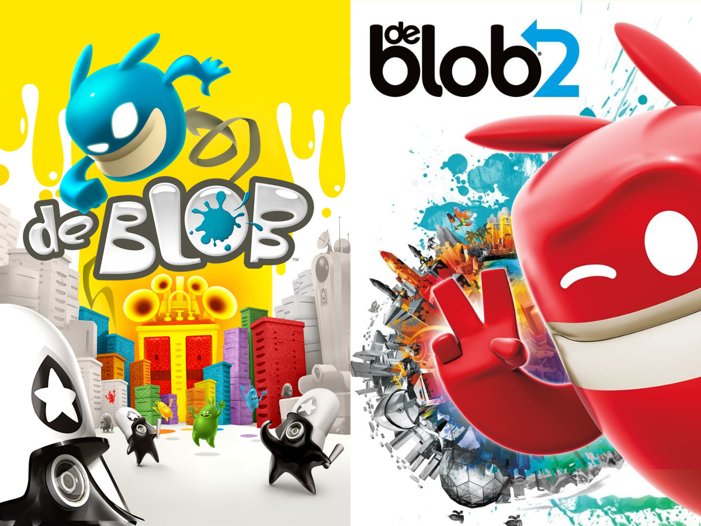

# deBlob_manual_apworlds
Manual apworlds for the de Blob Series, made with [Manual for Archipelago](https://github.com/ManualForArchipelago/Manual).

# How do I use this?
I will refer you to the offical [Archipelago setup guide](https://archipelago.gg/tutorial/Archipelago/setup_en) for how to set up Archipelago.

Use the `Install APWorld` option in the Archipelago launcher to install the `.apworld` files from the [Releases tab](https://github.com/Iristallite/deBlob_manual_apworlds/releases/latest)  
I have also provided some template `.yaml` files with the release.  
You can also just grab the `.apworld` and `.yaml` files from the folders, but I'd recommend sticking to the Releases for simplicity's sake.

# What's a *de Blob?*

  </img> 
  <b>de blob</b> and <b>de Blob 2</b> copyright 2008, 2011 THQ Nordic GmbH 

de Blob and de Blob 2 are 3D platformers all about color![sic][^1]  
I'm sorry if you're colorblind.

de Blob 1 is more open-ended; you can complete level challenges in any order, and the only thing blocking the exit is your score.  
de Blob 2 is more story-driven; you have to complete each level's missions in order....unless you use speedrun skips  
de Blob 2 (DS/i) is a linear 2D platformer that still retains some gameplay elements from the console games.
# Where can I get the games?
* de Blob 1: [Steam](https://store.steampowered.com/app/532320/de_Blob), [GOG](https://gog.com/game/de_blob), [Switch](https://nintendo.com/store/products/de-blob-switch), [Xbox One](https://xbox.com/games/store/de-blob/c092flk91x41), [PS4](https://store.playstation.com/product/UP4389-CUSA09934_00-DEBLOBONEUS00001), Wii[^2]
* de Blob 2 (DS/DSi): Unfortunately you'll need to find a second-hand cartridge for this one.
* de Blob 2: [Steam](https://store.steampowered.com/app/563190/de_Blob_2), [GOG](https://www.gog.com/game/de_blob_2), [Switch](https://nintendo.com/store/products/de-blob-2-switch), [Xbox 360](https://xbox.com/games/store/de-blob-2/btzcngwlqpz0)[^3], [Xbox One](https://xbox.com/games/store/de-blob-2/c360xv52r4nl), [PS4](https://store.playstation.com/product/UP4389-CUSA10447_00-DEBLOB2US0000001), PS3[^4]
* de Blob 1 (DS): It never released.[^5]
* de Blob 1 (Mobile): Possibly delisted?[^6] There is an `.apk` of the Android version floating around online though. Maybe I'll do it someday?
* de Blob Revolution: Exclusive to 32-bit iOS[^7] and *Windows Phone,* the latter of which I *somehow* have an `.xap` for, but I can't sideload it onto my HTC 8X because nobody cares about non-Lumia Windows Phones.
* There is also a [Steam bundle](https://store.steampowered.com/bundle/44665/de_Blob_Bundle/) of de Blob 1 and de Blob 2.

# How does this manual apworld work, exactly?
...It doesn't! At least in terms of connecting to the game.well, duh, it's a *manual* apworld  
More seriously, you'll have to rely on 100% save files ([dB1](https://www.speedrun.com/de_Blob/resources/m5gk0), [dB2](https://www.speedrun.com/dB2/resources/ezw7w), [dB2 DS(i)](https://www.speedrun.com/db2ds/resources/iix74)) and/or [ingame cheats](#ingame-cheats) to affect the game directly.  
This apworld shuffles each level as an item, as well as a specific amount of "McGuffins" that you'll need to open the final level(s).  
In addition, there are some traps, cheats, upgrades (dB2), and some extra-special *diabolical traps* that are sure to ruin your day... if you're playing in a multiworld....receiving a "Restart Level" *after* you beat a level kinda... entirely defeats the point, eh?  
Also there's DeathLink if you're into that.
# Wait, how does DeathLink work in a manual?
1. Locate the nearest source of damage or bottomless pit
2. Touch it until Blob dies and loses a life
3. Acknowledge you have received the deathlink by pressing the button in the client
4. If you continue from a game over in dB2, you should probably say goodbye to your S rank  
If you die accidentally, *you* send a deathlink to everyone else
# de Blob 1: Checks
* `Level Complete`: Complete the level.  
For Bonus Levels (`X-2`/`X-3`), I have arbitraily decided that you need to get a Gold Medal. You *can* ignore this, but I'll frown at you.
* `Gold Medal`: Self-explanatory.
* `100% Painted`: Paint *everything* in the level. If you can't find the last thing, try holding the Compass button!
* `Challenger`: Complete all *Challenges* within the level. This usually also gets you the `Architect` check (Landmarks Award) as well.
* `Speedrunner`: Beat the target *Time* listed under `(Main Menu) --> EXTRAS --> AWARDS --> (LEVEL)`. Stringing together combos is the key!
* `Stylist`: What a *style!* Collect them all!
* `Naturalist`: Save the *trees!* Restore them all!
* `Architect`: Shake! Shake! Shake! Restore all the *landmarks* INKT has defaced!
* `Street Artist`: You hate advertising, don't you? Tag all the *billboards!*
* `Transformer`: Optimus Paint Engine. Activate all the *Transform* Engines in each level; They spawn at certain Score intervals, and will always interrupt you with a skippable cutscene when they do.  
Yes, "Optimus Paint Engine." is the actual description of the trophy (called Transformers, I might add) that you get for doing this in every level.
* `Liberator`: They may take away our color, but they'll never take away our freedom! Free all the *Raydians* in each level from the Graydian suits the INKT Corporation has locked them in!
* `Blimp Painted`: To *blimp* and beyond! At certain points in each level, the Color Underground's *blimp* will appear. Tag it for a check!  
A bunch of these are references to the trophy descriptions in the HD re-release.
# de Blob 1: Items
#### Levels
* `X-X: LevelName`: Should be obvious. I'm not going to list all 30 of them.  
Note: `X-1` is the main level, while `X-2` and `X-3` are "Bonus Missions".
#### McGuffins
* `Comrade Black's Plans`: `9` out of `12` required to access `10-1 (Lake Raydia)` and beat the game.
#### Traps
* `Restart Level`: Press the `RESTART` button in the pause menu to restart the level. ...Diabolical.
* `High-Performance Ink`: Cap the game at 30fps for 5 minutes. **If you're unable to change the FPS cap without restarting the game, *ignore this item.***
* `Broken Brakes`: For 5 minutes, you are not allowed to press Brake (`B`/`R2`/`RT`/`ZR`) to brake in mid-air.   
...wow that's a lot of different buttons  
You are still allowed to press Brake to crouch while on solid ground.  
* `Invert Camera`: Change the "Invert Camera" option to the *opposite* of your preference for 5 minutes, then change it back.
* `Free Lossless Ink Codec`: Turn the Music volume down to 0 for 2 minutes, then turn it back up.
#### Cheats
* `+10 Minutes`: Self-explanatory, refer to the table below.
* `Extra Life`: Self-explanatory, refer to the table below.
* `Temporary Invulnerability`: Each `Temporary Invulnerability` item is worth 30 seconds of the "Invulnerability" cheat being turned on.  
As an example, you can use 2 of them together for 1 minute of invulnerability.  
As an example of *how you could use this cleverly*, you can skip a certain section of `9-1 (Ministry of Ink)` by swimming through a pool of Ink while Invulnerability is on.
#### Shiny Filler
* `Color Wheel`: Named after the slightly uncommon collectible worth 1000 points, unfortunately this does nothing... but there are only `6` of them!~
# de Blob 2 (DS/i): Checks
* `Level Complete`: Complete the level....pretty self-explanatory. again.
* `Musical Collector`: Maybe collecting the *3 big music notes* will save this game's terrible audio quality? It won't.
* `Liberator`: Rescue all the Raydians!
* `Chroma Camera`: Only present on certain levels *and* only in the DSi version, these do... well, nothing if they've already been collected on the save, otherwise you get a stupid but charming camera-gimmick minigame.  
Unfortunately, dB2 DS doesn't reset the in-level progress trackers if you replay from a 100% save, so... bust out the pen and paper!
# de Blob 2 (DS/i): Items
#### Levels
* `X-X: LevelName`: Should be obvious. I'm not going to list all 30 of them.
#### McGuffins
* `Rocket Parts`: `30` out of `36` required to access `7-1 (The Final Showdown)` and beat the game.
#### Traps
* `High-Resolution Ink`: Lower the internal resolution to 1x for 5 minutes. **If you're playing on a real console or not increasing the emulated IR, *ignore this item.***
* `Restart Level`: Press the `RESTART` button in the pause menu to restart the level. ...Diabolical.
#### Shiny Filler
* `Big Music Note`: Named after the 3 big music notes in each level, unfortunately this does nothing... but there are only `6` of them!~
# de Blob 2: Checks
* `(LevelName) Liberated`: Not your typical "Level Complete" check; dB2 has a sort of "micro-postgame" in most of its levels!
You can tick off this check once you see the Pinky icon that lets you fast-travel between checkpoints and exit the level.
* `S Rank`: If you do *everything* in each level, (and don't get any Game Overs), you should easily get the S rank.
* `Trophies: Blob Survivor`: Simply complete a level without dying to earn this....if you're playing with DeathLink on, *good luck.*
* `Trophies: INKT Informed`: Fill out "Pinky's Guide to Inkies" to earn this one. You'll need to play *all* the levels for it! (Or you can just !release after Hypno Ray I guess)  
If you already have the trophy or are playing on Wii/Switch/GOG, tick this off tick this off when you see Comrade Black's character portrait. (or a vertex explosion if you're playing on GOG/Steam)
* `Trophies: Piston Partisan`: In the level `State College`/`Comrade Black U.`, there are a few sections where you can chain together piston jumps. Do 10 in a row for the check!
* `Trophies: Pinky to the Rescue`: This is basically a free check.  
On console, connect a second controller and press whatever your platform equivalent of the `START` button is.  
On PC, press P on the keyboard, then you can control Pinky with the mouse!  
If you do some clever mapping with a gyro/touchpad-enabled controller, you can probably play as both Blob and Pinky simultaneously, which I imagine has quite some potential!
# de Blob 2: Items
* `Paradise Island`, `Downtown`, `Blanctown`, `The Senate`, `State College`, `Soda Falls`, `Hydro Station)`, `House of Fun`, `Orbital Habitats`, `Railyards`: Level unlocks.  
Please note that once `The Senate` is completed, the names on the level select for levels 5-10 (`State College`-`Railyards`) change due to story reasons.  
This only applies if you haven't cleared the respective level, however.  
The alternate names are provided in (brackets) in the manual tracker to prevent confusion.
#### McGuffins
* `Rocket Parts`: `12` out of `16` required to access `Rocket Range` and build the `Color Underground Rocket`.
* `Color Underground Rocket`: Received for completing `Rocket Range`. Required, alongside `7 Color Energy Beams`, to access the final level `Hypno Ray`.
* `Color Energy Beam`: `7` out of `12` required, alongside the `Color Underground Rocket`, to access the final level `Hypno Ray` and beat the game.
#### Traps
* `High-Performance Ink`: Cap the game at 30fps for 5 minutes. **If you're unable to change the FPS cap without restarting the game, *ignore this item.***
* `Broken Brakes`: For 5 minutes, you are not allowed to press Brake (`B`/`T`/`R2`/`RT`/`ZR`) to brake in mid-air, with two exceptions.  
...wow that's a lot of different buttons  
1: You are still allowed to press Brake to crouch while on solid ground.  
2: You are still allowed to press Brake immediately following a Charge Attack, as prevention against the *Launch Glitch.[^8]*
* `Invert Camera`: Change the "Invert Camera X/Y" options to the *opposite* of your preference for 5 minutes, then change them back.
* `Free Lossless Ink Codec`: Turn the Music volume down to 0 for 2 minutes, then turn it back up.
* `Pinky Short-Circuit`: Bans the use of the second player (Pinky) for 5 minutes. **If you're not playing with Pinky, *ignore this item.***
* `Restart Checkpoint`: Quit the level and enter it again from the menu. **DO NOT USE THE `RESTART` BUTTON IN THE PAUSE MENU; THAT WILL RESTART THE *ENTIRE LEVEL***
* `Restart Level`: Press the `RESTART` button in the pause menu to restart the level. ...Diabolical.
#### Cheats
* `+10 Minutes`: Self-explanatory, refer to the table below.
* `Extra Life`: Self-explanatory, refer to the table below.
* `Armor Refill`: Self-explanatory, refer to the table below.
* `Chroma Crystal`: Semantics time! One "use" of this allows you to input the cheat *as many times as you need* until you're at the desired colour, *then* it's been "used up".
#### Shiny Filler
* `Big Color Atom`: Named after the common collectible worth 1000 points, unfortunately this does nothing... but there are only `3` of them!~

# Ingame Cheats

The "Cheat" items literally allow you to use ingame cheats!  
You can use each cheat once for each of the corresponding item you have.  
To use a cheat, hold down the Activator and then press the corresponding button sequence.  
`T` and `S` are Triangle and Square buttons respectively.  
The "Unlock All Levels" cheats must be input at the main menu.  
If there's no "Unlock All Levels" cheat for your specific game, here are 100% save files: ([dB1](https://www.speedrun.com/de_Blob/resources/m5gk0), [dB2](https://www.speedrun.com/dB2/resources/ezw7w), [dB2 DS(i)](https://www.speedrun.com/db2ds/resources/iix74))
dB1 Cheats:
| Console | Activator  | Time Bonus | Extra Life | Invulnerability | Unlock All Levels |
| ------- | ---------- | ---------- | ---------- | --------------- | ----------------- |
| Wii     | C (Nunchuk)| `1 2 1 2`  | `1 1 2 2`  | `1 1 1 1`       | `B B 1 2 1 2 B B` |
| Xbox/PC | View/Back  | `A Y A Y`  | `A A Y Y`  | `A A A A`       | Unknown           |
| PS4     | Touchpad   | `X T X T`  | `X X T T`  | `X X X X`       | Unknown           |
| Switch  | Unknown    | Unknown    | Unknown    | Unknown         | Unknown           |
  
dB2 Cheats:
| Console | Activator  | Time Bonus | Extra Life | Armor Refill | Chroma Crystal (Change Color) | Unlock All Levels |
| ------- | ---------- | ---------- | ---------- | ------------ | ----------------------------- | ----------------- |
| Wii     | C+Z        | `1 2 1 2`  | `1 1 2 2`  | `1 2 1 1`    | `2`, then D-Pad Right/Left x3 | `1 2 2 1 1 2 2 1` |
| Xbox/PC | LB+LT      | `Y X Y X`  | `Y Y X X`  | `Y X Y Y`    | `X`, then D-Pad Right/Left x3 | `Y X X Y Y X X Y` |
| PS3/PS4 | L1+L2      | `T S T S`  | `T T S S`  | `T S T T`    | `S`, then D-Pad Right/Left x3 | `T S S T T S S T` |
| Switch  | L+ZL       | `X Y X Y`  | `X X Y Y`  | `X Y X X`    | `Y`, then D-Pad Right/Left x3 | `X Y Y X X Y Y X` |

For dB2 DSi, simply press Select to use a Chroma Crystal. It even has actual UI!

# Future Ideas
I'm also thinking of making a manual apworld for the original [*Utrecht School of the Arts **student project*** version of "De Blob"](https://archive.org/details/TheBlob_201501) (note the capital D).  
I don't have much in the way of "receivable items", but I could probably squeeze a few checks out of it.  
Sidenote: As if the Switch ports of the de Blob games weren't bad enough already, those bastards capitalized the *de!!!*  
With actual game integration, there are a few things we could do that we can't do right now.  
If a "Restart Level" trap is received, we could set lives to 0 and kill Blob to force a game over (I personally find dB1's game over sound hilarious)  
Traps that *lower* the timer, and a *diabolical trap* that sets the timer to something ridiculously low like 30 seconds, hope you can find a timer pickup!!!

[^1]: I'm Canadian and we spell it "colour", but since we get the same versions of games as the US, *all* of the games have a blatant "typo" everywhere (sigh)
[^2]: You can find the Wii version of de Blob 1 second-hand at retro game stores and on sites like eBay.
[^3]: The Xbox 360 version, strangely enough, is backwards compatible with Xbox One and Series X/S consoles.  
If you can get Xbox Live sign-in to work on your 360, it'll still show up in your purchase history if you buy the BC version... for now at least.  
Source: I did this with the Banjo-Kazooie games so I could play them on a CRT
[^4]: I'm pretty sure the PS3 version of de Blob 2 is still available to purchase, but you'll need to add funds via the PSN website (or a PS4/PS5) and then visit the store on an actual PS3 to find it.
[^5]: THQ shut down the developer Helixe mid-production.  
There is a prototype ROM floating about, but it's too unstable for me to consider an apworld for it, and it would probably also get flagged for piracy in the official Archipelago discord.
[^6]: I do own the iOS version, and I know it was still listed as late as 2017, so maybe it'll still show up if you search for it on a device running iOS 10 or older?
[^7]: Same situation with dB1 mobile where I own the iOS version but not a device old enough to run it.
[^8]: The *Launch Glitch* depends on *your PC's hardware* ***and*** *which level you're playing.* For example, it happens in Rocket Range on my PC, but not in the same level on my Steam Deck.
